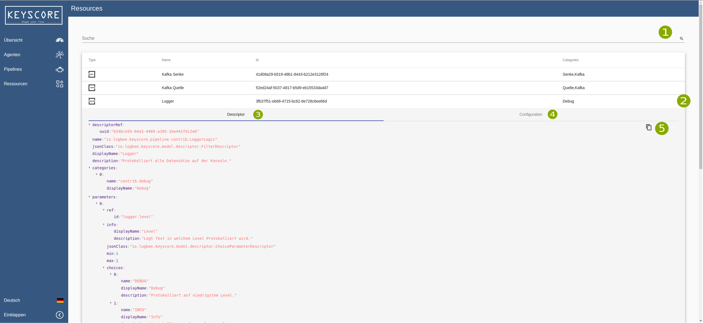

= Building a pipeline =

*How to read this chapter*:

- If you are new -- nice to see you here, we are curious about your feedback -- you can simply read this
chapter from top to bottom starting with the <<Step-by-Step Guide>>.

- If you are already familiar with the UI and only need some general information about where to do what the <<UI-overview>>
will hopefully match your expectations.

== Step-by-Step Guide ==

This chapter will introduce the UI by providing a step-by-step guide which will conclude in a working pipeline you can
experiment with.
After you finished the guide you will be able to create pipelines and be familiar with the multiple concepts of configuration.

=== UI-Overview ===

Here you can find an overview over the multiple screens of the ui.
They provide a short description for the multiple actions.

=== Agents ===

- Agents Table - This Table enlists all the registered agents. By pushing the delete Button you can remove the agent form the list.
  This will not delete the running instance of the agent in the kubernetes cluster.

. Refresh - manual refresh button to reload the data about the agents.
. Search - here you can search for every criteria which is listed in the data table.
. Delete - delete the agent from the table.

           Warning! This will not delete the running instance of the agent in the kubernetes cluster.

=== Dashboard ===

- Dashboard - Providing information about the state of the running pipelines.

=== Resources ===

- Resources - Is a developer only feature which provides you with a list of all resources which are currently stored.
              This includes Configurations and Descriptors for each block.

=== Pipelines ===

This view presents all currently existing pipelines in the system, while displaying general information about them.
By clicking on a pipeline you will be redirected to the <<Pipeline-Editor>>.
Further functionality wil be explained after this figure.

image:resources/images/pipelines-overview.png[Overview for the pipelines.]

. Refresh Timer - Here you can choose between a range of possibilities to reload the data automatically.
. Create Pipeline - This button will bring you to the <<Pipeline-Editor>> where you can create a new pipeline.
. Search - You can search the table of existing pipelines by the table headers.
. Status - This indicates wheter you pipeline is running/green, materializing/yellow or stopped/red.
. Forwarding - This will also bring you to the <<Pipeline-Editor>> but with the selected pipeline loaded into it.
. Response - Responses to creating a pipeline are shown with this popup.

=== Pipeline-Editor ===
The Pipeline-Editor is the key-feature of the ui.
Here you can create a new Pipeline or edit an existing one.
Simply put the pieces together with drag and drop and configurate them by entering the presented fields.

Generally there are three main components:

. Toolbar - In the Toolbar you can find a set of blocks which can be dragged into the workspace.
            They are ordered by categories.  If a block is in more than one category it will be present multiple times
            in the Toolbar.

. Configuration - Whether you are configuring the pipelines name, a sink source or filter, the possible configurations
                  are always displayed here.
//TODO: Add aditional image with datapreview
. Data Preview - When the Data Preview is active, it is displayed in the same location than the Toolbar.
                 It provides you with detailed information about what kind of data is running through your block.

