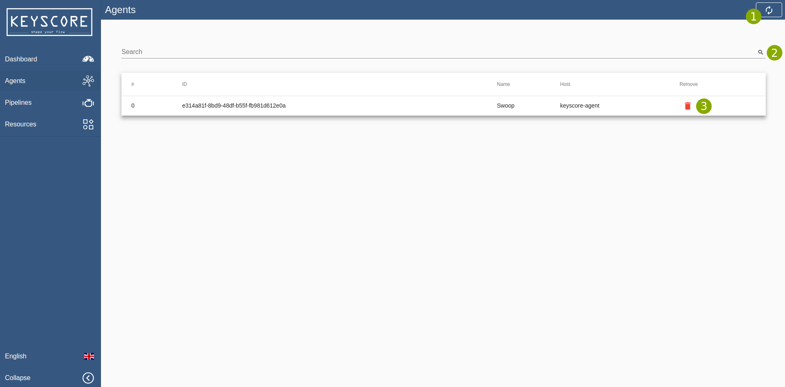
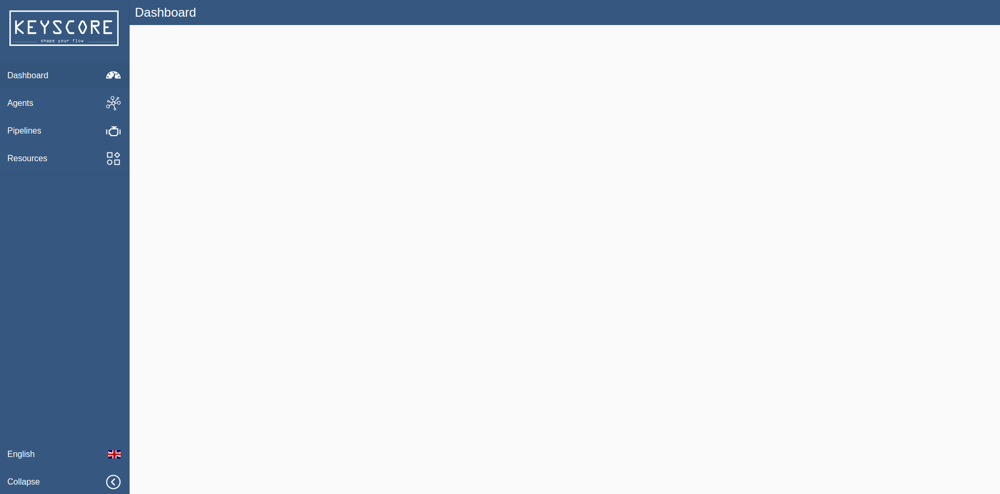
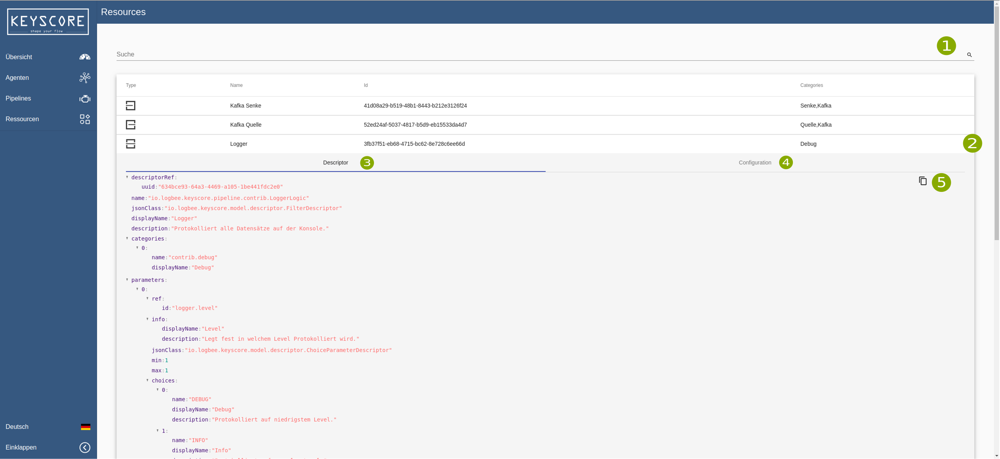
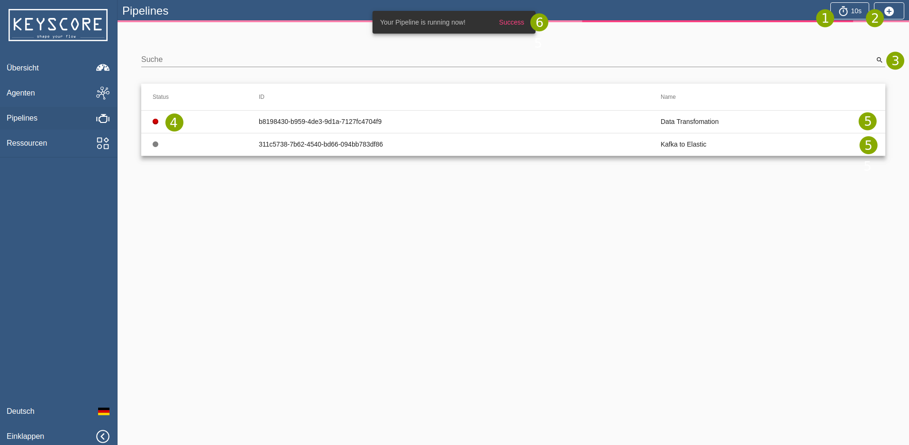
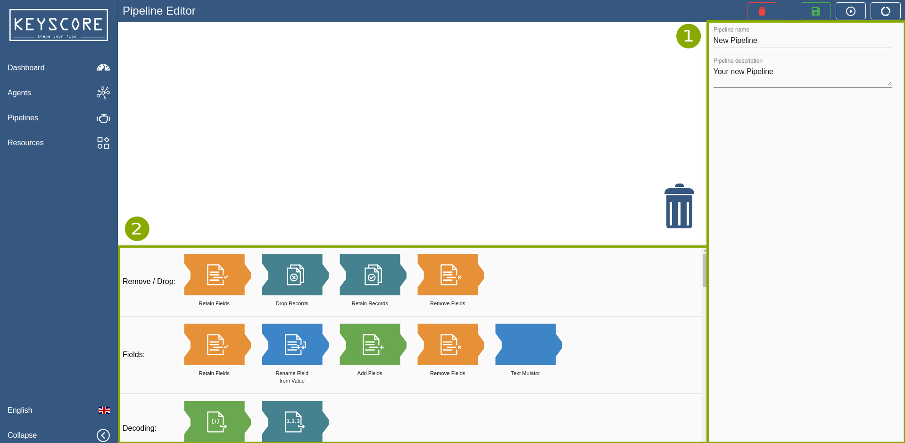
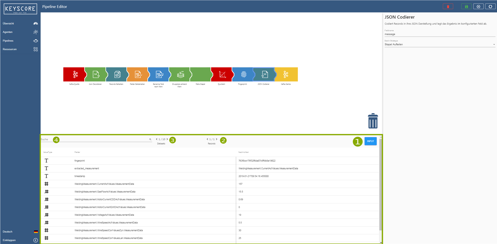

= Building a pipeline =

*How to read this chapter*:

- If you are new -- nice to see you here, we are curious about your feedback -- you can simply read this
chapter from top to bottom starting with the <<Step-by-Step Guide>>.

- If you are already familiar with the UI and only need some general information about where to do what the <<UI-overview>>
will hopefully match your expectations.

== Step-by-Step Guide ==

This chapter will introduce the UI by providing a step-by-step guide which will conclude in a working pipeline you can
experiment with.
After you finished the guide you will be able to create pipelines and be familiar with the multiple concepts of configuration.

=== Simple Pipe ===
. Go to edit/create pipeline
  To create a new pipeline you go to the <<Pipelines>> site and select the plus icon in the right corner.
  What you now see is the so call <<Pipeline-Editor>>. Here you can create an new pipeline. You can also
  update existing pipelines by selecting them in the <<Pipelines>> table.
  For a general overview over the multiple functionalities of this editor, please have a look at <<Pipeline-Editor>>.

. Create a Source

. Create a Sink

. Create a Filter

. Run/Save the pipeline

=== Enhanced Pipe with Decoders ===

. Create a Json Decoder

. Create a Json Encoder

. Run/Save the pipeline

=== UI-Overview ===
[[userguide-ui-overview]]
== Overview ==

Here you can find an overview over the multiple screens of the ui.
They provide a short description for the multiple actions.

=== Agents ===

- Agents Table - This Table enlists all the registered agents. By pushing the delete Button you can remove the agent form the list.
  This will not delete the running instance of the agent in the kubernetes cluster.

. Refresh - manual refresh button to reload the data about the agents.
. Search - here you can search for every criteria which is listed in the data table.
. Delete - delete the agent from the table.

           Warning! This will not delete the running instance of the agent in the kubernetes cluster.

=== Dashboard ===

- Dashboard - Providing information about the state of the running pipelines.

=== Resources ===

- Resources - Is a developer only feature which provides you with a list of all resources which are currently stored.
              This includes Configurations and Descriptors for each block.

. Search - You cann search the table of  existing resources by the tables headers.
. Details - When clicking on an entry the row will be expanded. The expanded row provides two different tabs [underline]#Descriptor# and [underline]#Configuration#.
            Both views are providing you with a json visualisation of the current configuration  and descriptor.
. Descriptor - Showing the descriptor json when selecting this tab.
. Configuration - Showing the configuration json when selecting this tab.
. Copy - Copying the selected json to paste it somewhere.

=== Pipelines ===

This view presents all currently existing pipelines in the system, while displaying general information about them.
By clicking on a pipeline you will be redirected to the <<Pipeline-Editor>>.
Further functionality wil be explained after this figure.

. Refresh Timer - Here you can choose between a range of possibilities to reload the data automatically.
. Create Pipeline - This button will bring you to the <<Pipeline-Editor>> where you can create a new pipeline.
. Search - You can search the table of existing pipelines by the table headers.
. Status - This indicates wheter you pipeline is running/green, materializing/yellow or stopped/red.
. Forwarding - This will also bring you to the <<Pipeline-Editor>> but with the selected pipeline loaded into it.
. Response - Responses to creating a pipeline are shown with this popup.

=== Pipeline-Editor ===
The Pipeline-Editor is the key-feature of the ui.
Here you can create a new Pipeline or edit an existing one.
Simply put the pieces together with drag and drop and configurate them by entering the presented fields.

Generally there are three main components:

. Toolbar - In the Toolbar you can find a set of blocks which can be dragged into the workspace.
            They are ordered by categories.  If a block is in more than one category it will be present multiple times
            in the Toolbar.

. Configuration - Whether you are configuring the pipelines name, a sink source or filter, the possible configurations
                  are always displayed here.

. Data Preview - When the Data Preview is active, it is displayed in the same location than the Toolbar.
                 It provides you with detailed information about what kind of data is running through your block.

The Data preview provides you with live data for the complete Pipeline or per block if you want.
If nothing is selected the output of the last block will be displayed.
When selecting any other block in your pipeline the table will be updated.
The table shows you the last 10 messages which ran through the block.
Please note that this can be old data and it does not indicate that there is currently data streamed.

. Input/Output - switching between output and input messages of a block.
. Records - If there are multiple records in one message you can swipe through them with the provided controls.
. Messages - If there are multiple messages in you can swipe through them with the provided controls.
. Search - You can search the table of extracted messages by the table headers.

